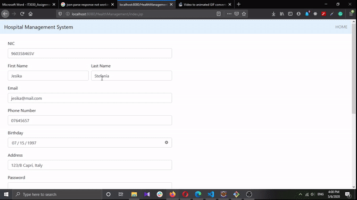
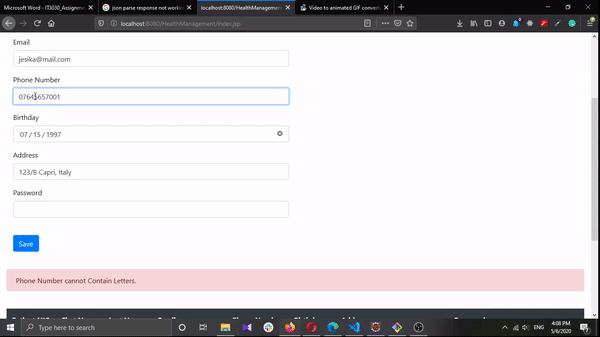

# PAF-Individual-Assignment-

>  IT17036580

>  H.K.D.B.Fernando

- Scenario 

HelthCare is a hospital management system where the registered users can make appointments with the registered doctors who visit the registered hospitals. The users can even make the payments for the appointments online.

# DEMO 1

# DEMO 2

# DEMO 3

.gif)

# DEMO 4

.gif)
